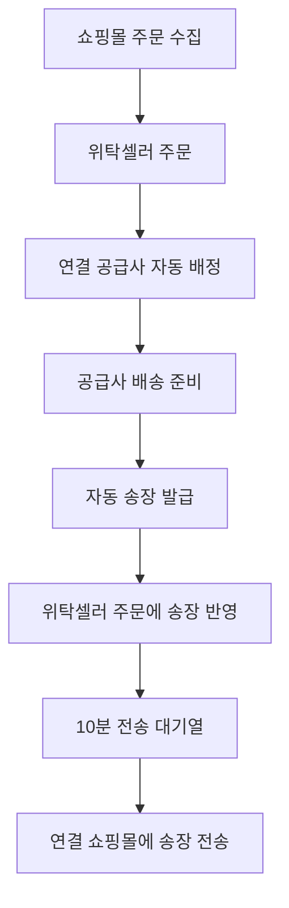
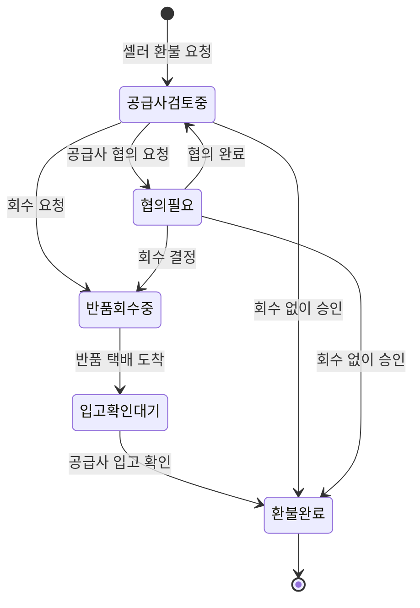

# 두고마켓 최신 기술 인수인계서

> 수신 대상: Claude AI 또는 후속 개발자  
> 작성 기준일: 2026-09-14  
> 기준 커밋: `f1a43bc471ca6d689bbb8209a99a00e26224cf6e`  
> 배포 버전: Sites version 17  
> 서비스명: **두고마켓 (DOOGO MARKET)**

## 1. 먼저 읽어야 할 핵심

이 파일과 함께 전달된 소스는 두고마켓의 최신 브라우저 프로토타입이다. 위탁셀러, 공급사, 마스터 3개 역할의 운영 흐름을 한 개의 정적 웹앱으로 구현했다.

- 프레임워크 없는 HTML/CSS/JavaScript 정적 앱이다.
- 서버, 데이터베이스, 실제 결제, 은행 이체, 택배사, 쇼핑몰 API는 아직 연결하지 않았다.
- 화면에서 변경한 데이터는 브라우저 `localStorage`에만 저장된다.
- 현재 구현은 UI/UX와 업무 규칙을 검증하기 위한 프로토타입이다.
- 후속 개발자는 기존 동작을 보존하면서 API·DB 기반 제품으로 전환해야 한다.
- 사용자에게 받은 외부 서비스 로그인 정보나 실계정 인증정보는 소스와 이 문서에 포함하지 않았다.

현재 공개 미리보기:

- https://doogofood-ops-hub.eugenemoon.chatgpt.site

## 2. 실행 방법

별도 빌드 과정이 없다. 압축을 푼 폴더에서 정적 서버만 실행한다.

```bash
python3 -m http.server 4173 --directory dist
```

브라우저에서 `http://localhost:4173`을 연다.

루트 파일을 직접 검토할 때는 다음 명령도 가능하다.

```bash
python3 -m http.server 4173
```

### 데모 계정

| 역할 | 아이디 | 비밀번호 | 로그인 위치 |
|---|---|---|---|
| 위탁셀러 | `seller` | `seller` | 첫 로그인 화면 |
| 공급사 | `sup` | `sup` | 파트너센터 → 공급사 |
| 마스터 | `admin` | `admin` | 파트너센터 → 관리자 |

추가 샘플 회원은 `app.js`의 `initialState.members`에 있으나, 기본 검증은 위 3개 계정으로 진행한다.

## 3. 파일 구조

```text
doogo-market-latest/
├── DOOGO_MARKET_CLAUDE_HANDOFF.md   # 이 문서
├── .openai/
│   └── hosting.json                 # Sites 정적 배포 설정
├── index.html                       # 로그인·가입·앱 셸·공통 모달
├── app.js                           # 상태, 렌더링, 이벤트, 업무 규칙 전체
├── styles.css                       # 데스크톱·태블릿·모바일 스타일
├── assets/
│   ├── doogomarket-symbol.png
│   ├── doogomarket-wordmark.png
│   ├── doogohub-app-icon.png
│   ├── doogohub-symbol.png
│   ├── doogofood-logo.png
│   └── product-00.jpg ~ product-07.jpg
└── dist/                             # 실제 배포 대상
    ├── index.html
    ├── app.js
    ├── styles.css
    └── assets/                       # 루트 assets와 동일
```

루트의 `index.html`, `app.js`, `styles.css`와 `dist/`의 동명 파일은 현재 SHA-256 기준으로 동일하다. 수정 후 배포하려면 루트 변경을 `dist/`에도 동기화해야 한다.

## 4. 기술 스택과 구조

| 구분 | 현재 구현 |
|---|---|
| UI | 순수 HTML + 템플릿 문자열 |
| 스타일 | 순수 CSS, 다중 반응형 미디어 쿼리 |
| 상태 | 단일 JavaScript 객체 `state` |
| 영속화 | 브라우저 `localStorage` |
| 인증 세션 | `sessionStorage` |
| 이벤트 | 공통 클릭·폼 제출 이벤트 위임 |
| 배포 | `dist/` 정적 사이트 |
| API | 미연결, 모두 데모 상태 변경 |
| 테스트 | 문법 검사, 소스·dist 해시 비교, 수동 역할별 시나리오 |

### 브라우저 저장 키

| 키 | 용도 |
|---|---|
| `doogofood-ops-demo-v1` | 전체 데모 업무 데이터 |
| `doogofood-current-account` | 현재 로그인 계정 |
| `doogofood-remembered-id` | 로그인 아이디 기억 |

현재 상태 스키마 버전은 `18`이다. `loadState()`에 이전 브라우저 데이터 마이그레이션과 기본 데이터 병합 규칙이 있다. 기존 사용자 데이터를 보존해야 하므로 이 함수를 삭제하거나 단순 덮어쓰지 않는다.

## 5. 브랜드와 UI 원칙

- 최종 서비스명은 **두고마켓**이다. 이전 이름인 두고푸드·두고허브는 일부 레거시 파일명과 저장 키에만 남아 있다.
- 핵심 포지셔닝은 브랜드·제조사·공급사와 위탁셀러를 연결하는 B2B 식품 소싱 오픈마켓이다.
- 공급사는 판매 매출 기준 7% 플랫폼 수수료 구조를 전제로 한다. 현재 `platformFee(amount)`가 7%를 계산한다.
- 위탁셀러 UI는 흰색 기반, 선택 메뉴는 파란색이다.
- 공급사·마스터 로그인은 검정/차콜 그라데이션 계열을 사용한다.
- 공통 화면은 넉넉한 여백, 큰 카드, 명확한 숫자, 클릭 가능한 행/버튼을 우선한다.
- 모바일 사용 비중이 높다는 전제다. 720px 이하에서 사이드바는 오버레이 메뉴로 열리고, 표는 모바일 카드 또는 가로 스크롤로 전환된다.
- 로그인 헤드라인은 `startTyping()`으로 타이핑 모션을 제공하고 `prefers-reduced-motion`을 존중한다.

## 6. 역할별 메뉴

### 위탁셀러

1. 대시보드
2. 두고마켓
3. 가져온 상품
4. 공급사 문의
5. 주문관리
6. 취소 환불
7. 매출 캘린더
8. 가격 변경알림
9. 쇼핑몰 연동
10. 정기구독
11. 내정보

### 공급사

1. 대시보드
2. 상품 관리
3. 거래처 연결
4. 주문 · 출고 관리
5. 취소 · 환불
6. 배송 · 송장 설정
7. 가격 관리
8. 정산 내역
9. 내 정보

### 마스터

1. 대시보드
2. 회원 승인
3. 공급사 관리
4. 위탁셀러 관리
5. 거래처 연결
6. 상품 관리
7. 주문 관리
8. 취소 · 환불
9. 운영 로그

메뉴 정의는 `roleMenus`, 아이콘 매핑은 `menuIcons`에 있다. 전역 상단 검색은 상품명이 아니라 **주문번호·주문자명·연락처**를 검색하고 주문 상세를 연다.

## 7. 주요 데이터 모델

`initialState`의 최상위 컬렉션은 다음과 같다.

| 키 | 의미 |
|---|---|
| `members` | 계정, 역할, 사업자 정보, 승인 상태 |
| `supplierApplications` | 위탁셀러의 공급사 권한 신청·심사 이력 |
| `products` | 공급사가 등록한 원본 공급상품 |
| `sellerProducts` | 위탁셀러가 가져온 상품과 채널별 판매 정보 |
| `orders` | 판매채널 주문, 공급사 배정, 배송, 정산 상태 |
| `connections` | 공급사–위탁셀러 거래처 관계 |
| `connectionInvites` | 공급사 연결 코드 |
| `connectionMessages` | 거래처 단위 두고톡 메시지 |
| `shippingProfiles` | 택배사, 출고지, 계약코드, 라벨 설정 |
| `goodflowConnections` | 굿스플로 데모 연동 상태 |
| `refunds` | 취소·반품·환불 상태와 두고머니/정산 결과 |
| `channelConnections` | 쇼핑몰 연결 및 송장 자동전송 설정 |
| `subscriptions` | 셀러 기본 구독 |
| `notificationServices` | 알림톡·이메일·PC 알림 설정 |
| `notificationEvents` | 상단 알림함 이벤트 |
| `deposits` | 두고머니 잔액, 원장, 계좌, 출금 요청 |
| `salesLedger` | 매출 캘린더 집계 원천 |
| `priceAlerts` | 공급가 변경 알림 |
| `errors` | 외부 연동·검증 오류 |
| `logs` | 운영 감사 로그 |

### 제품 데이터의 두 층

`products`는 공급사의 마스터 상품이다. `sellerProducts`는 셀러가 상품을 가져올 때 만들어지는 판매용 복제 참조다.

```text
products.id
  └─ sellerProducts.productId
       ├─ channelStatuses[channelId]
       └─ channelDetails[channelId]
            ├─ title
            ├─ salePrice
            ├─ category
            └─ reviews
```

각 판매채널은 판매명, 소비자가, 카테고리, 리뷰 수, `판매중`/`판매중지·미노출`/`미연동` 상태를 따로 가진다.

## 8. 구현된 기능

### 공통

- 위탁셀러/공급사/마스터 로그인 분리
- 위탁셀러·공급사 아이디 찾기와 비밀번호 재설정
- 마스터 계정 복구 메뉴 비노출
- 사업자 회원가입 신청, 마스터 승인·반려
- 상단 알림함 팝업, 읽음 상태
- 계정 메뉴와 사업자 정보 수정
- 데모 데이터 초기화
- 모바일 사이드바 열기·닫기·배경 클릭·ESC 처리

### 공급사 권한 신청과 사용자 전환

- 일반 위탁셀러는 기본적으로 공급사 권한이 없다.
- 내정보/사용자 전환에서 `공급사 요청하기`를 연다.
- 문구는 자체 브랜드 상품을 두고마켓 위탁셀러에게 공급한다는 목적을 명시한다.
- 신청은 마스터의 공급사 신청 심사 목록에 들어간다.
- 마스터는 승인 또는 반려한다.
- 반려 시 사유를 저장하고 신청자에게 표시한다.
- 반려된 사용자는 재신청할 수 있으며 `attempt`가 증가한다.
- 승인된 계정은 `roles: ["seller", "supplier"]`가 되고, 사용자 전환 모달에서 역할을 선택한다.
- 원클릭으로 즉시 역할을 바꾸지 않고 명시적 선택 단계를 둔다.

### 위탁셀러

- 국가·브랜드·카테고리·국내/해외배송별 공급상품 소싱
- 두고마켓 상품 상세 열람 및 `나의 상품으로 가져오기`
- 가져온 상품 보관함
- 연결된 쇼핑몰에 자동등록하는 데모 버튼
- 네이버 스마트스토어, 쿠팡, 카카오 쇼핑, CAFE24별 판매 상태 관리
- 채널별 상품명, 소비자가, 공급가, 마진율, 카테고리, 리뷰 수 표시
- 공급가 변경 시 대형 팝업에서 여러 채널 판매가 일괄 변경
- 주문 단계 하위 메뉴 열기/닫기
- 주문 등록 현황, 전체 주문, 주문대기, 주문접수, 배송준비중, 배송중, 배송완료
- 주문번호·고객명·연락처·상품명·채널 검색
- 단건 주문 접수와 공급사 자동 배정
- 두고머니 또는 판매대금 정산 차감으로 공급대금 처리
- 날짜별 매출/순수익 달력, 복수 채널 표기, 날짜 클릭 시 상품 순위·수량·매출·수익 상세
- 쇼핑몰별 10분 송장 자동전송 설정
- 신규주문·송장·환불·가격변동·배송지연·재고부족 이메일 알림 선택
- 두고톡과 PC 알림 설정

### 공급사

- 대시보드 카드 클릭 이동
- 상품 신규 등록, 수정, 재고 조정, 판매 상태
- 발주오라를 참고한 상세 상품 등록 폼
- 거래처 연결 코드 발급 및 셀러별 판매/주문 현황
- 신규주문 → 배송준비중 → 배송중 → 배송완료
- 배송준비중에서 자동송장 출력
- 송장 발급 시 배송중으로 전환되고 셀러 주문에 송장 반영
- 배송중 가송장 취소 처리
- 굿스플로 연결 설정 데모
- 공급가 변경과 셀러 알림 생성
- 월별 정산예정/정산완료 탭
- 사업자 정보 수정
- 반품 회수/입고 확인/회수 없음 승인

### 마스터

- 전체 운영 대시보드
- 회원가입 승인·반려 및 반려 사유
- 공급사 권한 신청 승인·반려 및 재신청 이력
- 공급사·위탁셀러 디렉터리
- 거래처 연결 현황
- 전체 상품과 주문 조회
- 전체 취소·환불 모니터링
- 운영 로그·오류 확인

## 9. 주문·송장·드랍쉬핑 흐름



현재 `runSellerTrackingSync()`가 10분 주기 동작을 흉내 낸다. 브라우저 탭이 열려 있을 때만 `setInterval`이 실행되므로 운영 제품에서는 서버 스케줄러/큐 작업으로 교체해야 한다.

## 10. 환불 및 두고머니 확정 로직

이 부분은 최신 구현의 핵심 업무 규칙이다.

### 금액을 반드시 분리한다

1. **소비자 환불액**: 셀러가 판매채널에서 소비자에게 돌려주는 판매금액
2. **두고머니 환급액**: 셀러가 공급사에 부담한 공급대금
3. **공급사 정산 제외액**: 두고머니 환급액과 동일한 공급대금

기본 계산:

```text
소비자 환불액 = 주문 판매금액
두고머니 환급액 = 공급가 × 환불 수량
공급사 정산액 = 환불 확정 시 0원
```

예시: 사과 2개, 소비자가 29,900원, 공급가 21,800원인 주문

- 소비자 환불액: 59,800원
- 위탁셀러 두고머니 환급액: 43,600원
- 공급사 정산: 0원

### 상태 머신



화면의 한글 상태값은 다음과 같다.

- `공급사 검토중`
- `협의 필요`
- `반품 회수중`
- `공급사 입고확인 대기`
- `환불완료`

### 권한 규칙

- 위탁셀러는 판매채널에서 소비자 환불을 먼저 처리했다고 확인한 후 두고마켓에 요청한다.
- 위탁셀러는 임의로 `환불완료` 처리할 수 없다.
- 공급사만 회수 여부를 결정한다.
- 실물 반품이면 택배 도착 후 공급사가 `반품 입고 확인`을 눌러 확정한다.
- 농수산물처럼 회수하지 않는 건은 공급사가 `회수 없이 승인`할 수 있다.
- 협의는 주문마다 새 채팅방을 만들지 않고 기존 거래처별 두고톡에 `[환불 협의 주문번호]`로 남긴다.

### 환불 확정 시 원자적으로 처리할 항목

`finalizeRefund()`가 현재 한 번에 수행하는 동작:

1. 환불 상태를 `환불완료`로 변경
2. 공급사 입고 또는 회수 없음 승인 기록
3. 셀러 `pending`에서 공급대금 차감
4. 셀러 `balance`에 공급대금 충전
5. `환불 충전` 원장 추가
6. `supplierSettlementOffset = true`
7. 원 주문 `settlementStatus = excluded`
8. 셀러 알림과 운영 감사 로그 생성

같은 환불을 두 번 충전하지 않도록 `deposit.transactions.reference === refund.id`를 확인한다. 운영 서버에서도 이 idempotency 규칙을 DB unique key와 트랜잭션으로 강제해야 한다.

## 11. 두고머니 지갑과 출금

`deposits[loginId]` 구조:

```js
{
  balance,             // 사용 가능 두고머니
  pending,             // 환불 확정 전 예정액
  withdrawalPending,   // 은행 이체 결과 대기액
  totalRefunded,
  bankAccount,
  withdrawals: [],
  transactions: []
}
```

지원하는 화면 흐름:

- 환불 확정 후 사용 가능 두고머니 충전
- 공급상품 주문 시 두고머니로 공급대금 결제
- 출금 계좌 등록/변경
- 1,000원 이상 출금 신청
- 신청 즉시 `balance` 차감, `withdrawalPending` 증가
- 이체 성공 시 `withdrawalPending` 차감, `출금완료`
- 이체 실패 시 `withdrawalPending` 차감, `balance` 자동 복구

현재 계좌 검증과 이체 성공/실패는 데모 버튼이다. 운영 적용 시 PG/지급대행사 또는 적법한 전자금융 구조를 검토하고 계좌 실명 확인, 이체 요청, 결과 웹훅, 재처리, 정산대사, 자금세탁방지, 이용약관·개인정보·회계 처리를 별도로 설계해야 한다.

## 12. 핵심 함수 위치

모든 핵심 로직은 `app.js`에 있다.

| 영역 | 주요 함수 |
|---|---|
| 상태 | `cloneInitial`, `loadState`, `saveState` |
| 인증 | `showLogin`, `showPartnerLogin`, `showApp`, `initAuth`, `accountRecoveryModal` |
| 역할 | `accountRoles`, `setRole`, `userSwitchModal`, `supplierApplicationModal` |
| 공통 렌더링 | `render`, `updateAccountUI`, `renderSeller`, `renderSupplier`, `renderMaster` |
| 두고마켓 | `sellerMarketplaceTemplate`, `productDetailModal`, `importModal` |
| 셀러 상품 | `sellerProductsTable`, `manageProductChannelsModal`, `reviewPriceModal` |
| 주문 | `sellerOrderManagementTemplate`, `ordersTable`, `orderDetailModal`, `simulateOrderModal` |
| 배송 | `trackingModal`, `autoIssueTracking`, `autoIssueAllTracking`, `shipmentCancelModal`, `shipmentLabelModal` |
| 드랍쉬핑 | `queueTrackingSync`, `runSellerTrackingSync`, `channelIntegrationTemplate` |
| 두고톡 | `partnerMessengerTemplate`, `sellerConnectionTemplate`, `supplierConnectionTemplate` |
| 환불 | `refundTemplate`, `refundRequestModal`, `refundDetailModal`, `refundConsultModal`, `finalizeRefund` |
| 두고머니 | `sellerDeposit`, `doogoMoneyModal`, `doogoMoneyBankModal` |
| 달력 | `salesCalendarTemplate`, `salesProductBreakdown` |
| 공급사 상품 | `registerProductModal`, `editProductModal`, `productEditorModal`, `adjustStockModal` |
| 정산 | `supplierSettlementTemplate`, `platformFee` |
| 알림 | `pushNotification`, `notificationCenterModal`, `notificationService` |
| 감사 | `audit`, `logsTemplate` |

## 13. 운영 제품으로 전환할 때 권장 백엔드 모델

브라우저의 한 개 `state` 객체를 다음과 같은 서버 테이블로 분리한다.

| 테이블 | 핵심 컬럼 |
|---|---|
| `users` | id, login_id, password_hash, status |
| `business_profiles` | user_id, company, representative, business_no, contact, email, document_url |
| `user_roles` | user_id, role, status, approved_at |
| `supplier_applications` | seller_id, attempt, payload, status, rejection_reason |
| `products` | supplier_id, sku, title, supply_price, recommended_price, stock, status |
| `seller_products` | seller_id, product_id, sale_price, snapshot_version |
| `channel_accounts` | seller_id, channel, encrypted_credentials, status |
| `channel_listings` | seller_product_id, channel_account_id, external_product_id, title, price, category, review_count, status |
| `orders` | seller_id, supplier_id, channel_order_id, totals, customer_snapshot, status |
| `shipments` | order_id, carrier, tracking_no, provisional, status |
| `refunds` | order_id, consumer_refund_amount, seller_refund_amount, status, reason |
| `return_shipments` | refund_id, carrier, tracking_no, delivered_at, received_at |
| `wallet_accounts` | owner_id, available, pending_refund, pending_withdrawal |
| `wallet_ledger` | wallet_id, type, amount, reference_type, reference_id, balance_after |
| `withdrawal_accounts` | owner_id, bank_code, encrypted_account_no, holder, verified_at |
| `withdrawal_requests` | wallet_id, amount, provider_request_id, status |
| `settlements` | supplier_id, period, gross, fee, refund_offset, payable, status |
| `connections` | supplier_id, seller_id, status |
| `conversations` | connection_id |
| `messages` | conversation_id, sender_id, order_reference, body |
| `notifications` | recipient_id, type, payload, read_at, delivery_status |
| `audit_logs` | actor_id, action, entity_type, entity_id, before_json, after_json |

`wallet_ledger`는 수정하지 않는 append-only 원장으로 구현하고 `(reference_type, reference_id, type)`에 unique constraint를 둔다.

## 14. 권장 API 계약

최소 엔드포인트 예시:

```text
POST   /auth/login
POST   /auth/recovery/id
POST   /auth/recovery/password/request
POST   /auth/recovery/password/confirm

GET    /me
PATCH  /me/business-profile
POST   /supplier-applications
GET    /admin/supplier-applications
POST   /admin/supplier-applications/:id/approve
POST   /admin/supplier-applications/:id/reject

GET    /market/products
POST   /seller-products/import
POST   /seller-products/:id/listings
PATCH  /seller-products/:id/listings/:channel

GET    /orders
POST   /orders/manual
POST   /orders/:id/accept
POST   /orders/:id/shipments
POST   /orders/:id/shipments/cancel

POST   /refunds
POST   /refunds/:id/request-pickup
POST   /refunds/:id/request-consultation
POST   /refunds/:id/return-delivered
POST   /refunds/:id/confirm-receipt
POST   /refunds/:id/approve-without-pickup

GET    /wallet
POST   /wallet/withdrawal-accounts/verify
POST   /wallet/withdrawals
POST   /webhooks/payout-provider
POST   /webhooks/channels/:channel/orders
POST   /webhooks/carriers/tracking
```

### 서버 트랜잭션 경계

다음은 반드시 하나의 DB 트랜잭션으로 처리한다.

- 환불 최종 상태 변경
- 두고머니 원장 적립
- 지갑 잔액 갱신
- 공급사 정산 제외
- 주문 정산 상태 변경
- 감사 로그 생성

## 15. 외부 연동 교체 목록

| 화면의 현재 데모 | 운영 구현 시 필요 항목 |
|---|---|
| 쇼핑몰 테스트 연결 | OAuth/API 키 암호화, 권한 검증, 토큰 갱신 |
| 주문 자동 수집 | 채널 웹훅 + 주기 폴링 + 중복 주문 방지 |
| 상품 자동등록 | 채널별 카테고리/속성 매핑, 이미지 업로드, 실패 재처리 |
| 송장 10분 자동전송 | 서버 큐, retry/backoff, channel_order_id 기반 멱등성 |
| 굿스플로 | 정식 계약 API, 송장 발급/취소/상태 조회 |
| 이메일·알림톡 | 템플릿 승인, 수신 동의, 발송 결과 저장 |
| 두고머니 출금 | 계좌 실명 확인, 지급대행, 웹훅 서명 검증, 정산대사 |
| 파일 업로드 | object storage, MIME 검사, 악성 파일 검사, 접근권한 |
| 회원 인증 | password hash, MFA/관리자 보안, 세션 만료, rate limit |

## 16. 보안·법무·회계 주의사항

- 현재 비밀번호는 데모를 위해 평문으로 코드에 있다. 운영에서는 Argon2id 또는 bcrypt 해시를 사용한다.
- 쇼핑몰 API secret, 택배 계약코드, 계좌번호는 브라우저 저장소에 저장하면 안 된다.
- 계좌번호·사업자 문서·연락처는 암호화와 접근통제가 필요하다.
- 마스터의 승인/반려/정산/환불 조정은 반드시 actor와 변경 전후 값을 감사 로그로 남긴다.
- 7% 수수료의 과세, 세금계산서, 환불 시 수수료 반환 규칙은 회계 정책으로 확정해야 한다.
- 두고머니가 선불전자지급수단 또는 전자금융업 규제 대상인지 법률 검토가 필요하다.
- 소비자 환불과 셀러 공급대금 복구는 서로 다른 회계 이벤트로 저장한다.
- 개인정보가 들어간 주문 검색과 대화는 역할·거래처 범위로 제한한다.

## 17. 모바일 확인 기준

최소 확인 해상도:

- 360 × 800
- 390 × 844
- 430 × 932
- 768 × 1024
- 1440 × 900

필수 점검:

1. 햄버거 버튼으로 메뉴가 열린다.
2. 배경, 닫기 버튼, 메뉴 항목, ESC로 메뉴가 닫힌다.
3. 모든 메뉴 항목이 한 번의 탭으로 이동한다.
4. 표가 화면을 밀어내지 않고 카드/스크롤로 표현된다.
5. 주문 단계 숫자와 금액이 모바일에서도 읽힌다.
6. 모달이 화면 너비 안에 들어오고 하단 버튼이 가려지지 않는다.
7. 공급사 요청, 역할 전환, 두고머니 계좌/출금, 환불 상세가 모바일에서 완료된다.
8. 달력은 가로 스크롤 또는 요약 표시로 탐색 가능하다.

## 18. 현재 알려진 한계

- 실제 서버가 없어 다른 브라우저/기기와 데이터가 공유되지 않는다.
- 로그인과 비밀번호 변경은 보안 인증이 아닌 UI 시뮬레이션이다.
- 새로고침 후 localStorage는 유지되지만 브라우저 데이터 삭제 시 사라진다.
- 2026년 9월 중심의 고정 샘플 데이터가 많다.
- 달력 이전/다음 달 버튼은 토스트만 보여주며 실제 월 전환은 미구현이다.
- 채널 상품 등록, 주문 수집, 송장 전송, 알림, 굿스플로, 출금은 실제 외부 전송을 하지 않는다.
- 채팅은 브라우저 상태에만 저장되고 실시간 소켓/읽음/파일 업로드가 없다.
- 공급사 수수료 7%는 계산 함수와 UI 전제만 있으며 실제 청구·세금계산서는 없다.
- 자동화는 브라우저 탭이 닫히면 멈춘다.
- 접근성 자동 테스트, 단위 테스트, E2E 테스트가 아직 없다.

## 19. 변경·배포 절차

1. 루트 `index.html`, `app.js`, `styles.css`를 수정한다.
2. `node --check app.js`로 문법을 검사한다.
3. 루트 파일과 assets를 `dist/`에 동기화한다.
4. 루트/`dist` 해시가 같은지 확인한다.
5. 역할별 데모 계정으로 핵심 시나리오를 수동 확인한다.
6. 정적 호스팅은 `.openai/hosting.json`의 `dist` 설정을 사용한다.

현재 Git 정보:

```text
branch: main
commit: f1a43bc471ca6d689bbb8209a99a00e26224cf6e
origin: https://git.chatgpt-team.site/8e687ed0-2af7-4d2f-b4ac-464803e33669/appgprj_6a9ead83afb881918247f7b435966834.git
```

원격 Git은 접근 권한이 필요할 수 있으므로, 이 인수인계 ZIP만으로도 실행 가능하도록 전체 추적 파일을 포함했다.

## 20. 권장 개발 우선순위

### 1단계: 데이터와 인증

- 백엔드 프로젝트, DB migration, 사용자/역할/RBAC
- 사업자 문서 저장
- 마스터 승인·반려 API
- 현재 `initialState`를 seed 데이터로 이전

### 2단계: 상품·주문·배송

- 공급상품, 가져온 상품, 채널 listing DB
- 주문 수집과 공급사 자동 배정
- 굿스플로 또는 택배 송장 API
- 송장 자동전송 큐와 실패 재처리

### 3단계: 환불·정산·두고머니

- 환불 상태 머신을 서버에서 강제
- append-only 지갑 원장
- 정산 보류/제외와 환불 원자적 처리
- 계좌 인증, 지급대행, 웹훅, 정산대사

### 4단계: 운영 품질

- 실시간 두고톡
- 알림톡/이메일
- 보안·감사·모니터링
- 단위/E2E/모바일 회귀 테스트

## 21. Claude AI에게 전달할 작업 지시문

아래 문장을 Claude AI에게 이 파일과 ZIP과 함께 전달하면 된다.

```text
첨부한 DOOGO_MARKET_CLAUDE_HANDOFF.md를 먼저 끝까지 읽고, 압축파일의 최신 소스를 분석해 주세요.
이 프로젝트는 두고마켓의 위탁셀러·공급사·마스터 운영 프로토타입입니다.
기존 UI와 업무 흐름을 처음부터 다시 만들지 말고 현재 동작을 보존해 주세요.
특히 schemaVersion 18 마이그레이션, 역할별 메뉴 순서, 공급사 권한 승인/반려/재신청,
거래처별 두고톡, 채널별 상품 상태, 주문·송장 자동화, 환불 상태 머신,
소비자 환불액과 공급대금 환급액 분리, 두고머니 원장과 공급사 정산 제외의 원자성은 바꾸지 마세요.
먼저 전체 소스 구조와 현재 한계를 요약한 뒤, 운영용 백엔드 전환 계획을 제시하고 작업을 시작해 주세요.
실제 외부 서비스 인증정보는 요청하거나 소스에 하드코딩하지 마세요.
```

## 22. 인수인계 완료 조건

후속 개발자가 다음 질문에 답할 수 있으면 문서 인수인계가 완료된 것이다.

- 세 역할의 로그인과 메뉴가 어디서 정의되는가?
- 공급사 권한 신청이 승인·반려·재신청될 때 어떤 데이터가 바뀌는가?
- 공급상품과 셀러가 가져온 상품의 관계는 무엇인가?
- 공급사 송장이 어떻게 셀러와 쇼핑몰 전송 대기열에 반영되는가?
- 환불 완료 권한은 누구에게 있으며 어떤 조건인가?
- 소비자 환불액과 두고머니 환급액은 왜 다른가?
- 환불 확정 시 지갑, 주문, 공급사 정산을 어떻게 한 번에 처리하는가?
- 어떤 기능이 실제 연동이고 어떤 기능이 데모인가?
- 모바일에서 반드시 회귀 테스트할 화면은 무엇인가?

---

최신 소스의 단일 기준은 기준 커밋 `f1a43bc471ca6d689bbb8209a99a00e26224cf6e`이다.
